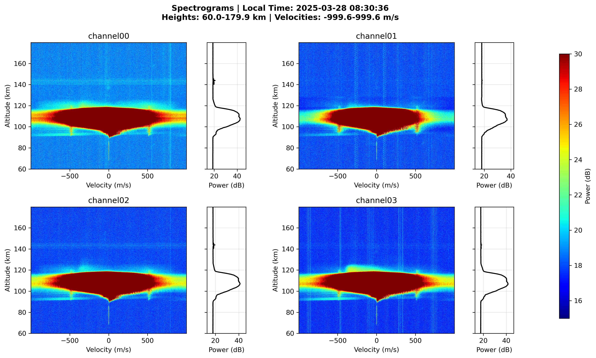

 # Herramienta de Procesamiento de Datos de Radar



## Visión General
Este conjunto de herramientas en Python procesa datos de radar en formato HDF5 para generar:
- Gráficos RTI (Range-Time-Intensity)
- Espectrogramas Doppler
- Perfiles de potencia y análisis de velocidad

Características principales:
- Procesa datos de estaciones de radar peruanas (huso horario UTC-5)
- Maneja datos de radar multicanal
- Incluye filtrado de ruido y normalización de datos
- Opciones de visualización interactiva

## Instalación

### Requisitos
- Python 3.12+
- Paquetes necesarios:
  ```bash
  pip install numpy matplotlib h5py pytz

## Inicio Rápido
Clona este repositorio

git clone git@github.com:sebastianVP/Schain_script.git

## Instala las dependencias:
pip install -r requirements.txt

## Uso - Comando Básico
python plot_spec_rti.py